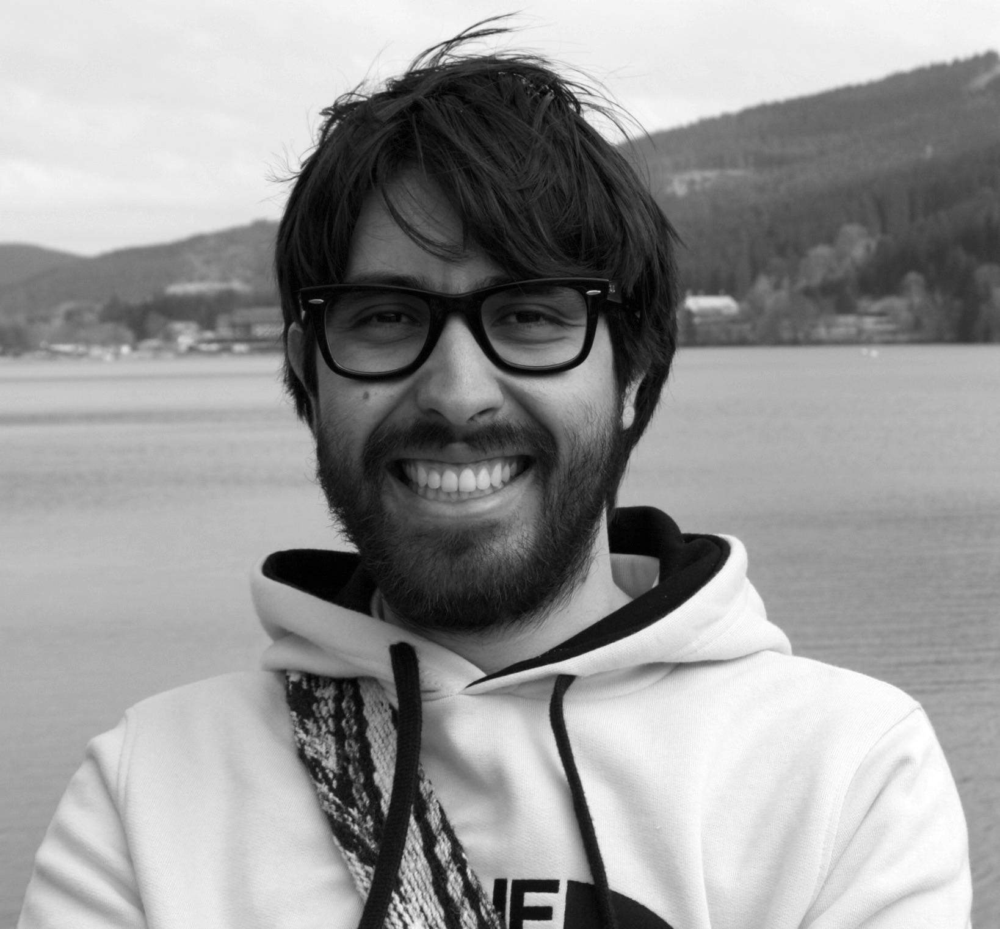

<figure>
	
	<figcaption>This picture was taken at the Titisee in the southern Black Forest, Germany.</figcaption>
</figure>

---

In October 2017 I received my PhD degree in Mathematics from [Humboldt Universität zu Berlin](https://www.mathematik.hu-berlin.de/de/forschung/forschungsgebiete/geometrische-analysis-und-spektraltheorie) under the supervision of [Prof. Jochen Brüning](https://www2.mathematik.hu-berlin.de/~bruening/). I obtained a Master degree (Mathematics) from this same university in 2014. My graduate studies were supported by the [Berlin Mathematical School](http://www.math-berlin.de). Here I share my [experience](http://www.math-berlin.de/about-bms/life-at-bms/life-at-bms/juan-from-colombia). Before comming to Berlin I did two bachelor degrees: [Mathematics](https://matematicas.uniandes.edu.co) and [Physics](https://fisica.uniandes.edu.co) at [Universidad de los Andes](https://uniandes.edu.co). 

My research interests are differential geometry, topology and geometric analysis, in particular variants of the [Atiyah-Singer Index Theorem](https://en.wikipedia.org/wiki/Atiyah–Singer_index_theorem) for singular spaces. Currently I'm also interested in topics around data analysis, statistics and machine learning.

I am also interested in education and knowlodge sharing.

---

**Contact:** juanitorduz@gmail.com

---

### Work Experience

- 01/04/2018-Present  **Data Scientist**, [TD Reply GmbH](https://www.tdreply.de), Berlin, Germany.

	- Integrate and unify data from various sources. Apply skills in data mining, quantitative analysis and visualization. Develop algorithms for a variety of business problems (e.g. sales predictions, media mix allocation, future behavior, market drivers, trends and growth potential) by applying knowledge in feature engineering, variable selection, statistical modeling and machine learning.

	- Text mining: text data pre-processing and vectorization, n-gram analysis, topic modeling, text network analysis.
􏰂 
	- Collaborate closely with a wide range of international clients, understanding their business needs and challenges. Consult on the selection of data sources (including web analytics, Buzz Tracking, CRM, Search) and their usage. Identify key performance indicators and give recommendations in meaningful presentations beyond numbers. Create reports and interactive dashboards based on digital data sources, enabling clients to extract insights from multiple data streams that build bridges between companies and customers.

	- Member of the [ProBonoProData Team](https://probono.td-berlin.com): Dedicated data and marketing experts sharing knowledge with  NGOs. 

		*Tools:* git, python, pandas, scikit-learn, nltk, gensim, R, tidyverse, tidytext, caret, H2O, ggplot, plotly.

- 01/07/2017-01/04/2018 **Junior Data Scientist**, [TD Reply GmbH](https://www.tdreply.de), Berlin, Germany.

- 01/01/2017-30/06/2017 **Trainee - Data Analyst**, [GoEuro](https://www.goeuro.com), Berlin, Germany.

	- Integrate provider data from various sources into the search engine. Normalize and geo-reference data from different sources. Automate and define new tools to scale and increase efficiency for the data quality program. 

		*Tools:* Jenkins, git, MySQL, python.

- 2014-2015 **Student Representative**, [Berlin Mathematical School](http://www.math-berlin.de), Berlin, Germany. 

     - Member of the organization committee of the [3rd−BMS Student Conference](https://sites.google.com/site/bmsstudentconference/home).

- 2008-2010 **Teaching Assistant**, [Universidad de los Andes](https://uniandes.edu.co), Bogotá, Colombia. 

     - *Courses: Linear Algebra, Basic Physics II, Riemannian Geometry.*

### Volunteering Activities

- 01/2018-03/2018 **Volunteering Data Scientist**, [CorrelAid Network](https://correlaid.org/en/network), Dashboard Project for [Projekt Seehilfe e.V.](http://www.seehilfe.com/en/home/)

- 03/2011-08/2011 **Mathematics Teacher**, [ColombiaCrece](http://www.colombiacrece.org/#educacion-solidaria), Bogotá, Colombia. 

- 06/2007-08/2007 **Camp Counselor**, [Skylake Yosemite Camp](http://www.skylake.com), Wishon, CA 93669, USA.

---

### Education

- 2014-2017 **PhD in Mathematics (Magna Cum Laude)**, [Humboldt Universität zu Berlin](https://www.mathematik.hu-berlin.de/de/forschung/forschungsgebiete/geometrische-analysis-und-spektraltheorie), Berlin, Germany.

	*Advisor:* [Prof. Jochen Brüning](https://www2.mathematik.hu-berlin.de/~bruening/)

	*Title of the Thesis:* Induced Dirac-Schrödinger on quotients of semi-free circle actions.
	
- 2011-2014 **M.Sc. Mathematics**, [Humboldt Universität zu Berlin](https://www.mathematik.hu-berlin.de/de/forschung/forschungsgebiete/geometrische-analysis-und-spektraltheorie), Berlin, Germany.

- 2005-2011 **B.Sc. Mathematics (Cum Laude)**, [Universidad de los Andes](https://matematicas.uniandes.edu.co), Bogotá, Colombia.

- 2005-2011 **B.Sc. Physics (Cum Laude)**, [Universidad de los Andes](https://matematicas.uniandes.edu.co), Bogotá, Colombia.

---

### Languages 

- Spanish: Native proficiency.
- English: Full professional proficiency.
- German: Professional working proficiency.

---

### Publications & Preprints

- [The $S^1$-Equivariant signature for semi-free actions as an index formula, J Geom Anal (2018)](https://doi.org/10.1007/s12220-018-0088-1)

- [Induced Dirac-Schrödinger operators on $S^1$-semi-free quotients, ArXiv (2017)](https://arxiv.org/abs/1711.04196)

---

### Certificates

Here are some online courses which I have taken. The purpose is two-folded:

 - Learn and understand the content of the courses.

 - Learn and see examples of how to present data science concepts/topics to a general audience. 

#### Data Analysis and Machine Learning

- [Machine Learning](https://www.coursera.org/account/accomplishments/certificate/R9HMKKTMYERD) (Coursera)
*Tools:* matlab

##### [Deep Learning Specialization](https://www.coursera.org/account/accomplishments/specialization/2BUB9H27CXFQ) (Coursera)

- [Neural Networks and Deep Learning](https://www.coursera.org/account/accomplishments/verify/GCZ4X2NAFH6H)
*Tools:* numpy.

- [Improving Deep Neural Networks](https://www.coursera.org/account/accomplishments/verify/D9M7YK49CBQ5)
*Tools:* numpy, tensorflow.

- [Structuring Machine Learning Projects](https://www.coursera.org/account/accomplishments/verify/PR8BZBW6JPZM)

- [Convolutional Neural Networks](https://www.coursera.org/account/accomplishments/verify/8JE96YG4V4TB)
*Tools:* numpy, tensorflow, keras.

- [Sequence Models](https://www.coursera.org/account/accomplishments/verify/SZKEPQV6FA68)
*Tools:* numpy, tensorflow, keras.

##### [Applied Data Science with Python Specialization](https://www.coursera.org/account/accomplishments/specialization/certificate/YB8Y4UU8NPHL) (Coursera) 

- [Introduction to Data Science in Python](https://www.coursera.org/account/accomplishments/certificate/DNRZYZ9YPVWZ) 
*Tools:* scipy, numpy and pandas.

- [Applied Plotting, Charting & Data Representation in Python](https://www.coursera.org/account/accomplishments/certificate/9KXJ898KD9D6) 
*Tools:* pyplot, matplotlib and seaborn.

- [Applied Machine Learning in Python](https://www.coursera.org/account/accomplishments/certificate/HW68UVKPCS45) 
*Tools:* scikit-learn.
 
- [Applied Text Mining in Python](https://www.coursera.org/account/accomplishments/verify/5PWPU2PJ77PS)
*Tools:* nltk.

- [Applied Social Network Analysis in Python](https://www.coursera.org/account/accomplishments/verify/5SGMBJ5VZBQG)
*Tools:* networkX.

#### Statistical Analysis

- [Econometrics: Methods and Applications](https://www.coursera.org/account/accomplishments/certificate/UE4YC74QZ3CA) (Coursera)
*Tools:* pyton: statsmodels (python).

- [Bayesian Statistics: From Concept to Data Analysis](https://www.coursera.org/account/accomplishments/certificate/FXSZL5EGNFZS) (Coursera)
*Tools:* R. 

- [Bayesian Statistics: Techniques and Models](https://www.coursera.org/account/accomplishments/records/LWE7E9V9CFED) (Coursera)
*Tools:* R and JAGS. 

#### Programming

##### [Functional Programming in Scala Specialization](https://www.coursera.org/account/accomplishments/specialization/certificate/YSRKZV9XKDKX) (Coursera)

- [Functional Programming Principles in Scala](https://www.coursera.org/account/accomplishments/certificate/D4RRBFQ69MT5)

- [Functional Program Design in Scala](https://www.coursera.org/account/accomplishments/certificate/QQJJTERTPDJX)

- [Parallel Programming](https://www.coursera.org/account/accomplishments/certificate/Y2AWNDPB4FSU)

- [Big Data Analysis with Scala and Spark](https://www.coursera.org/account/accomplishments/certificate/NF3NNPPDHJUM)

- [Functional Programming in Scala Capstone Protect](https://www.coursera.org/account/accomplishments/certificate/JUUDBW4YMH8V)

##### Python

- [Python 3 Course](https://www.sololearn.com/Certificate/1073-1102912/pdf/) (SoloLearn)

##### SQL

- [SQL Course](https://www.sololearn.com/Certificate/1060-1102912/pdf/) (SoloLearn)

--- 

### Selected Talks and Events

- 07/2018 [On Laplacian Eigenmaps for Dimensionality Reduction](https://pydata.org/berlin2018/schedule/presentation/33/), PyData Berlin 2018, Berlin, Germany.

- 08/2017 [Introduction to Bayesian modeling with PyMC3](https://www.meetup.com/Python-Users-Berlin-PUB/events/237520865/), Python Users Berlin (PUB), Berlin, Germany.

- 07/2017 [Workshop on Loop Spaces, Supersymmetry and Index Theory](http://www.math.nus.edu.sg/~mathanf/LSI/Loop%20space%20and%20supersymmetry.html), Chern Institute of Mathematics, Tianjin, China.

- 07/2017 [PyData Berlin](https://pydata.org/berlin2017/), Hochschule für Technik und Wirtschaft, Berlin, Germany.

- 08/2016 [Focus Program on Topology, Stratified Spaces and Particle Physics](http://www.fields.utoronto.ca/activities/16-17/stratifiedspaces), The Fields Institute for Research in Mathematical Sciences, Toronto, Canada.

- 07/2016 [Contributed Talk: Induced Dirac-Schrödinger operators on quotients of semi-free circle actions](http://www.7ecm.de/download/7ECM_Scientific\%20Programm.pdf), [7th European Congress of Mathematics](\href{http://www.7ecm.de/home.html), Berlin, Germany. 

- 06/2015 [Summer School: Geometric and Computational Spectral Theory](http://www.crm.umontreal.ca/sms/2015/index_e.php) Université de Montréal, Montreal, Canada.

- 09/2014 [Trimester Program: Non-commutative Geometry and its Applications](https://www.him.uni-bonn.de/programs/past-programs/past-trimester-programs/non-commutative-geometry-2014/description/), Hausdorff Research Institute for Mathematics, Bonn, Germany. 

---

### Hobbies

- Sports, music and [photography](https://www.flickr.com/photos/143384299@N04/). 

