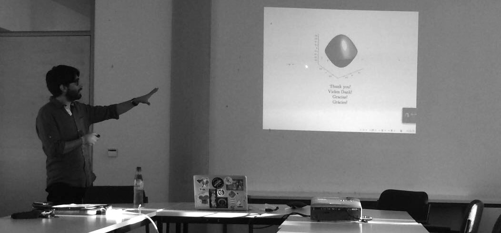
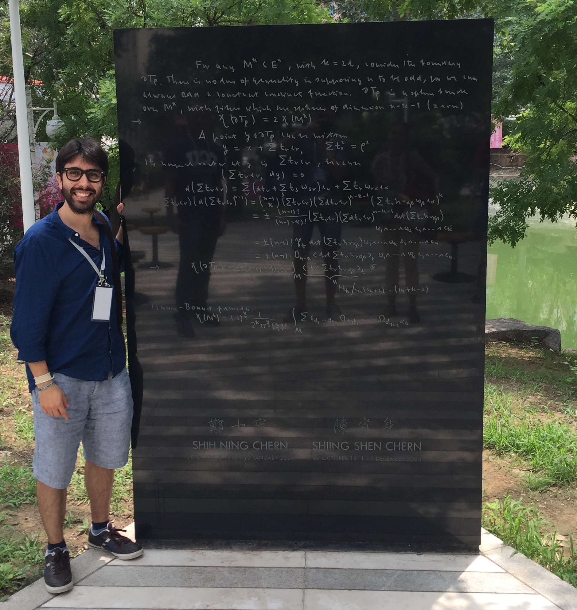

In this post I want to present the results of my Mathematics PhD thesis which I wrote under the supervision of [Prof. Dr. Jochen Brüning](https://www2.mathematik.hu-berlin.de/~bruening/) at [Humbolt Universität zu Berlin](https://www.mathematik.hu-berlin.de/de/forschung/forschungsgebiete/geometrische-analysis-und-spektraltheorie).

I gratefully acknowledge the financial support of the [Berlin Mathematical School](http://www.math-berlin.de) and the research project 
[SFB 647: Space - Time - Matter](http://www.raumzeitmaterie.de)

---

**Abstract:**

John Lott has computed an integer-valued signature for the orbit space
of a compact orientable $(4k+1)$ manifold with a semi-free $S^1$-action,
which is a homotopy invariant of that space, but he did not construct
a Dirac type operator which has this signature as its index. In this
Thesis, we construct such operator on the orbit space, a Thom-Mather
stratified space with one singular stratum of positive dimension, and
we show that it is essentially unique and that its index coincides
with Lott's signature, at least when the stratified space satisfies
the so called Witt condition. We call this operator the
*induced Dirac-Schrödinger operator*. The strategy of the construction is
to "push down" an appropriate $S^1$-invariant first order
transversally elliptic operator to the quotient space.

The Witt condition, a topological condition which in this case depends
on the codimension of the fixed point set, has various analytic
consequences.  In particular, when not satisfied, the Hodge-de Rham
operator on the quotient space does not need to be essentially
self-adjoint and therefore a choice of boundary conditions is
required. This choice freedom is not natural in view of the fact that
Lott's signature is well defined independently of the Witt condition.

The Dirac-Schrödinger operator constructed in this Thesis differs
from the Hodge-de Rham operator by a zero order term which ensures it
to be essentially self-adjoint. Moreover, this zero order term
anti-commutes with the chirality involution allowing the whole
operator to split so that the index can be computed even if the Witt
condition is not satisfied.

---

<figure>
	
	<figcaption>This picture was taken at the end of my thesis seminar at Humboldt Universität zu Berlin.</figcaption>
</figure>

---

- You can find a online copy of the complete thesis as a [preprint](https://arxiv.org/abs/1711.04196)
on the arXiv. (a second version was updated)

- In addition, [here]({filename}/documents/defense_orduz.pdf) you can see the slides of the defense. 

- The paper version, [The $S^1$-Equivariant signature for semi-free actions as an index formula](https://arxiv.org/abs/1802.04840), is now available on the arXiv.

---

<figure>
	
	<figcaption>This picture was taken at the Chern Institute of Mathematics in Tianjin (China) where I had the oportunity to present the results of this thesis.
	Here I am with Chern's proof of the Chern-Gauß-Bonnet Theorem.</figcaption>
</figure>

