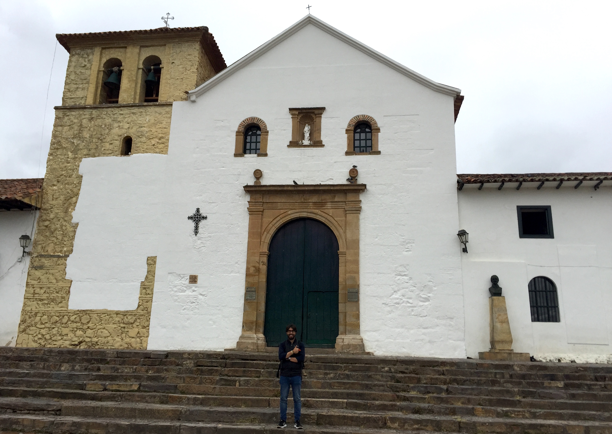
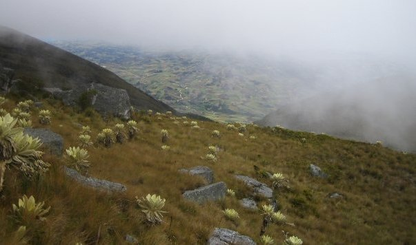

In this post I want to write about my experience as a participant (in various occasions) of the *Summer School on Geometric, Algebraic and Topological Methods in Quantum field Theory* in Villa de Leyva, Colombia. 

The idea of writing this post came to me in my last visit to Villa de Leyva in May 2018. 

<figure>
	
	<figcaption>This picture was taken in front of Villa de Leyva's main church.</figcaption>
</figure>

As described on the last school official [website](https://villadeleyvaschool.wordpress.com),

*These are series of summer schools in Colombia, which have taken place every other year since July 1999. The topics of these schools lie on the border line between geometry, topology, algebra and quantum field theory, and they offer courses addressed to both physicists and mathematicians with a master’s level in either of the fields.*

---

# The Location: Villa de Leyva

<iframe width="100%" height="400" src="https://maps.google.com/maps?width=100%&amp;height=400&amp;hl=en&amp;q=Villa%20de%20Leyva+(Villa%20de%20Leyva)&amp;ie=UTF8&amp;t=&amp;z=13&amp;iwloc=B&amp;output=embed" frameborder="0" scrolling="no" marginheight="0" marginwidth="0"><a href="https://www.maps.ie/create-google-map/">Google Maps iframe generator</a></iframe>
 

These summer schools took place at [Villa de Leyva](https://en.wikipedia.org/wiki/Villa_de_Leyva), a beautiful town in Colombia where nature, history and tranquility are always present. Well not always, tranquility is, from time to time, replaced by great festivals and events! People and culture around this area are amazing. I can honestly say that Villa de Leyva is my favorite place in the world. 

The following are probaly the most known events in Villa de Leyva. 

- [Wind & Kite Festival](http://www.colombia.travel/en/where-to-go/andean/villa-de-leyva/activities/wind-and-kite-festival)

- [Fiestas del Carmen](http://www.expovilla.com/eventos/ferias-y-fiestas-de-la-virgen-del-carmen)

- [Light Festival](https://www.calendariodecolombia.com/fiestas-nacionales/festival-de-luces-en-villa-de-leyva)

The first one, the [Wind & Kite Festival](http://www.colombia.travel/en/where-to-go/andean/villa-de-leyva/activities/wind-and-kite-festival), has a special meaning for me. As I child, I used to participate in the the Kite contest with my family.

The second one is also important since it overlaps with the summer school! 

---

# The Venue: Hotel Mesón De Los Virreyes

During the three consecutive times I attended the summer school we stayed at the [Hotel Mesón De Los Virreyes](http://www.hotelmesondelosvirreyes.com). This hotel is equipped with confortable and suitable installations for these types of events: nice rooms, a beautiful inner garden, amazing typical Colombian food and most importantly an excellent support staff. During the event we used to have a big conference room in the second floor were the talks were held. In the first floor they adapted a room to play the role of a library. 

In my latest visit to Villa de Leyva (May 2018) I had the opportunity to stay there as well. Many good memories came to me during my stay. Moreover, three members of the hotel staff still remembered me! 

---

# The Organizers

The summer school was the result of a massive amount of effort and dedication from the organizing committee:

- [Sergio Adarve](https://matematicas.uniandes.edu.co/index.php/personas/profesores), Mathematics Professor, Universidad de los Andes.

- [Alexander Cardona](https://pentagono.uniandes.edu.co/~acardona/), Mathematics Professor, Universidad de los Andes.

- [Hernan Ocampo](http://fisica.univalle.edu.co/index.php/profesores/hernan-ocampo-duran), Physics Professor, Universidad del Valle.

- [Sylvie Paycha](http://www.math.uni-potsdam.de/~paycha/paycha/Home.html), Mathematics Professor, Universität Potsdam.

- [Andres Reyes](https://fisica.uniandes.edu.co/personal/profesores-de-planta/andres-fernando-reyes-lega), Physics Professor, Universidad de los Andes.

[Alexander Cardona](https://pentagono.uniandes.edu.co/~acardona/) and [Andres Reyes](https://fisica.uniandes.edu.co/personal/profesores-de-planta/andres-fernando-reyes-lega) were my Mathematics and Physics Bachelor thesis advisors respectively. [Sylvie Paycha](http://www.math.uni-potsdam.de/~paycha/paycha/Home.html) was my [BMS Mentor](https://www.math-berlin.de/students/mentoring) during my PhD period at [Humbolt Universität zu Berlin](https://www.mathematik.hu-berlin.de/de).

---

# My Academic Experience 

As an undergrad student at [Universidad de los Andes](https://uniandes.edu.co) I had the privilege to attend three of these schools: 2009, 2011 and 2013. The experiences I had during these three events are quite different, mainly because of my mathematics/physics background, but also because I was at different stages on my way to getting a PhD. 

## [Villa de Leyva, 2009](https://matematicas.uniandes.edu.co/summer2009/)

During my first school I was in my third year of a double major program in physics and mathematics. I had already taken the basic courses: analysis, algebra, quantum and classical mechanics, thermodynamics and electromagnetism. Still, the summer school level was incredibly high. To be honest I think I understood around 10% of what was discussed during those three weeks. I realized how little I knew about these topics and that the journey was not going to be short and easy. I must admit I was scared and hesitant about my qualifications and skills. I felt so small when compared with those great scientists. Nevertheless, the ambient of the school was so that those thoughts and doubts would actually boost my desire to learn. I was gladly surprised how patient and friendly the speakers were.  There were three lectures, which had a special impact for me:

- Math & Physics Prerequisites: During the first two days of each summer school there would be *Prerequisite Sessions* on both, physics and mathematics, to level up young students and also to give the opportunity to mathematicians to learn about physics and the other way around. These sessions were particularly useful for me because I was one of those young students. These sessions were quite intense, but very effective. On the one hand side I was able to grasp on some advanced topics and on the other I took notes on definitions and theorems which I did not understand but defined my to-learn-list during the evenings in the library. A concrete example about what I got from those sessions is the definition of [connections](https://en.wikipedia.org/wiki/Connection_(principal_bundle)) and curvature on [principal bundles](https://en.wikipedia.org/wiki/Principal_bundle) and how to construct the corresponding objcts on associated vector bundles (via a group representation). I also  remember that, in one of these sessions, Hernan Ocampo gave a very nice lecture introducing [string theory](https://en.wikipedia.org/wiki/String_theory). 

- [Geometric Aspects of the Standard Model and the Mysteries of Matter](https://matematicas.uniandes.edu.co/summer2009/index.php?Op=1&TL=8) by [Florian Scheck](http://wwwthep.physik.uni-mainz.de/~scheck/). These lectures were very inspiring. Florian Scheck presented various topics in particle physics combining strong experiential intuition with the language of geometry to try to describe these phenomena. You can find a version of the lectures [here](http://wwwthep.physik.uni-mainz.de/~scheck/Colombia.pdf).
One year after, in the summer of 2010, I was actually invited to visit him at the [Johannes Gutenberg-Universität Mainz](http://www.uni-mainz.de) in order to work on my physics bachelor thesis and explore the ppossibilities of going to Germany to continue my graduate studies. As a matter of fact, I also visited Berlin that summer and I was immediately in love with the city. The decision to move to Berlin was definitely inspired by this (my first) visit to Germany. 

- [Geometric issues in Quantum Field Theory and String Theory](https://matematicas.uniandes.edu.co/summer2009/index.php?Op=1&TL=7) by [Luis J. Boya](https://www.researchgate.net/profile/Luis_Boya). These lectures were gave a rough introduction to mathematical tools around QFT and String Theory. The main topics were basic differential geometry, algebraic topology and applications. Again, my overall understanding of this material was quite low, but the way Luis J. Boya presented these topics really motivated me to go deeper in this direction. The late nights in the provisional library were essentially to try to catch up with the topics of these lectures. 

- [Geometry of Dirac structures](https://matematicas.uniandes.edu.co/summer2009/index.php?Op=1&TL=1) by [Henrique Bursztyn](http://w3.impa.br/~henrique/). This one was of great importance for me. A clear and insightful presentation of topics around Dirac structures and applications led me to choose this topic for my mathematics bachelor thesis. I was particularly interested in the notion of *prequantization*on these structures. This course was a great overview for me to deep dive into this topic. You can find the notes of the lecture [here](https://arxiv.org/abs/1112.5037).

- Exercise Sessions: In order to make us follow and understand the content of the lectures, the speakers would propose some exercises to work on. Then, we would work on them and present the solutions. This was extremely helpful! Not just because it forced us to fill up some math details, but also because it taught us to work together and collaborate to get results (which is actually the most fun part of doing research, in my opinion). 

## [Villa de Leyva, 2011](https://matematicas.uniandes.edu.co/summer2011/)
	
When I attended the school for the second time I had already gotten a Berlin Mathematical School Phase I scholarship to start my graduate studies in Berlin. I had also finished both bachelor degrees, physics and mathematics, and was preparing myself for a new adventure. I was quite open about my potential research area so that is why I decided to attend the summer school, I wanted to discover about new ideas and mathematics. Attending this school would actually helped my find my favorite area which I would devote the my future 5 years of research: [*Index Theory*](https://en.wikipedia.org/wiki/Atiyah–Singer_index_theorem).
	
- [Index theory and geometric quantization of non-compact manifolds](https://matematicas.uniandes.edu.co/summer2011/topics_lectures.html) by [Maxim Braverman](https://web.northeastern.edu/braverman/). This was not the first time that I had heard around the Atiyah-Singer index theorem. Nevertheless, it was the first time I had the tools to begin to understand it. These series of lectures began with the basics of Dirac operators and its analytical properties on compact manifolds, including the statement and key ingredients to understand Atiyah-Singer index theorem. Next, the prequantization problem was introduced and finally linked to the index theory in equivariant case on open manifolds. I took notes very carefully and tried to complete and understand the missing details during the evenings in the library at El Mesón De Los Virreyes. Moreover, after the series of lectures were over, there was an invitation looking for volunteers to help write a clean version which would be later be published in the proceedings. I was of course in participating! We team up with [Leonardo Cano](https://www.genealogy.math.ndsu.nodak.edu/id.php?id=202514) and [Carlos Pinilla](https://www.colorado.edu/math/carlos-pinilla-suarez) to compare notes and try to understand the content as much as possible with the guide of Maxim Braverman. In order to write these notes with true knowledge on the subject we decided to organize an internal seminar at Universidad de los Andes with the intention of going deeper into the details of Maxim Braverman's lectures. I gave the first talk introducing \\(K\\)-theory and some concrete examples (e.g. \\(K(S^2)\\). As I traveled to Berlin in September, I was just able to participate four a couple of weeks. You can find the resulting notes [here](https://arxiv.org/abs/1210.0929). 
I was lucky enough that upon my arrival to Berlin, I had the opportunity to attend a 2-semester course on the heat-kernel proof of the index theorem given by my future PhD advisor [Jochen Brüning](https://www.mathematik.hu-berlin.de/~bruening/). I was able to follow this course mostly because of my initial exposure to the topic I had during the summer school Villa de Leyva 2011. 

- [Noncommutative geometry models in particle physics and cosmology](https://matematicas.uniandes.edu.co/summer2011/topics_lectures.html) by [Matilde Marcolli](http://www.its.caltech.edu/~matilde/). I just wanted to mention Matilde Marcolli course because it was very impressive. She is a very (very!) strong mathematician who is also very (very!) comfortable talking about physics (theory and experiments). It was amazing how she was able to combine these two disicplines (are they really different?) by trying to understand and model article physics and cosmology. 

- In this occasion I had the opportunity to give a short talk on the moment map. This intended to complement the course of Maxim Braverman (in particular, the prequantization part). Preparing this talk was a great exercise. In particular, because I was really motivated to do a good presentation since I had the (positive) pressure of having the invited speakers in the audience. You can find the notes of my talk [here]({filename}/documents/moment_map_vdl11.pdf) . 

## [Villa de Leyva, 2013](https://villadeleyvaschool.uniandes.edu.co/summer2013/)

For this summer school I had already been living in Berlin for 2 years. I had taken courses in index theory, functional analysis, commutative algebra and algebraic topology. I was preparing myself to start writing my master thesis. Without a doubt I had much more experience than four years ago in my first summer school. Nevertheless, this did not mean that I would stop learning! On the contrary, I had a better toolbox to take more from the lectures. I feel that in  the three summer schools I attended, I had experiences and learnings at different levels, but all of them they linked and into the direction of one same objective: understanding how to do research. 

Two of the courses I enjoyed the most were

- [Lie groupoids and Lie algebroids -- connection theory and Poisson geometry](https://villadeleyvaschool.uniandes.edu.co/summer2013/) by [Kirill Mackenzie](http://kchmackenzie.staff.shef.ac.uk)

- [\\(C^\*\\)-algebras and Index Theory of Boundary Value Problems](https://villadeleyvaschool.uniandes.edu.co/summer2013/) by [Elmar Schrohe](http://www2.analysis.uni-hannover.de/~schrohe/)

- In this summer school I presented Hirzebruch's [Signature Theorem](https://en.wikipedia.org/wiki/Hirzebruch_signature_theorem) and a sketch of the proof using the structure of the oriented cobordism ring \\(\Omega_{SO}\otimes\mathbb{Q}\\). I also commented on the proof via the index theorem using the *signature operator*. This last was a key topic for my master thesis and my future research project during the PhD phase. Without a doubt, preparing this talk was a great exercise for me. You can find the slides of the talk [here]({filename}/documents/signature_vdl13.pdf).

During the last day of every summer school we (students, speakers and organizers) had a feedback meeting where the positive and potential improvements of the scope of the event was discussed. This was a time where each one of the attendants could openly speak to provide constructive feedback. Various concrete action items were collected to make the summer school better. This was indeed reflected in the later schools I attended. 

Last, but not least,  the contents of the tlaks were included into the offcicial summer school [proceedings](https://www.amazon.com/s/ref=nb_sb_noss?url=search-alias%3Daps&field-keywords=geometric+and+topological+methods+for+quantum+field+theory&rh=i%3Aaps%2Ck%3Ageometric+and+topological+methods+for+quantum+field+theory).

---

# My Non-Academic Experience 

<figure>
	
	<figcaption>I took this picture in my way up to Iguaque.</figcaption>
</figure>

Besides all the experiences and learning described above, I must mention how much fun it was! I met many students (from various universities), postdocs and professors with whom I had great and pleasant discussions beyond mathematics. During my first schools, it was quite helpful to hear experiences and advices from graduate students. In particular, hearing about the application process to study abroad and some do-and-don'ts. 

After the afternoon study sessions we would had time to enjoy Villa de Leyva: From dancing salsa at *Bar de Monica* to listening to some Rock & Roll in a local pub close to the main square. A particularly fun period was the overlap of the summer school with *Las Fiestas del Carmen*. 

During the weekends, many outdoor activities were offered. My favorite, which I did in all my three times I participated in the summer school, was the hike to [Iguaque](https://en.wikipedia.org/wiki/Lake_Iguaque). This hike is a *must* if you ever visit this area! Visiting [Raquira](https://en.wikipedia.org/wiki/Ráquira) or going to [El Infiernito](https://en.wikipedia.org/wiki/El_Infiernito) were other activities offered during the weekends. 

---

# Acknowledgment

The main motivation for writing this post is to acknowledge the effort of everyone that made these fantastic summer schools possible. In particular I would like to thank the organizing committee for investing so much time, energy and love into bringing top level research to Colombia. These events were a great motivation for me to get a PhD abroad, and I am sure that there are many cases similar to mine. 

I hope these efforts, and in particular these series of summer school can continue for many years. 
